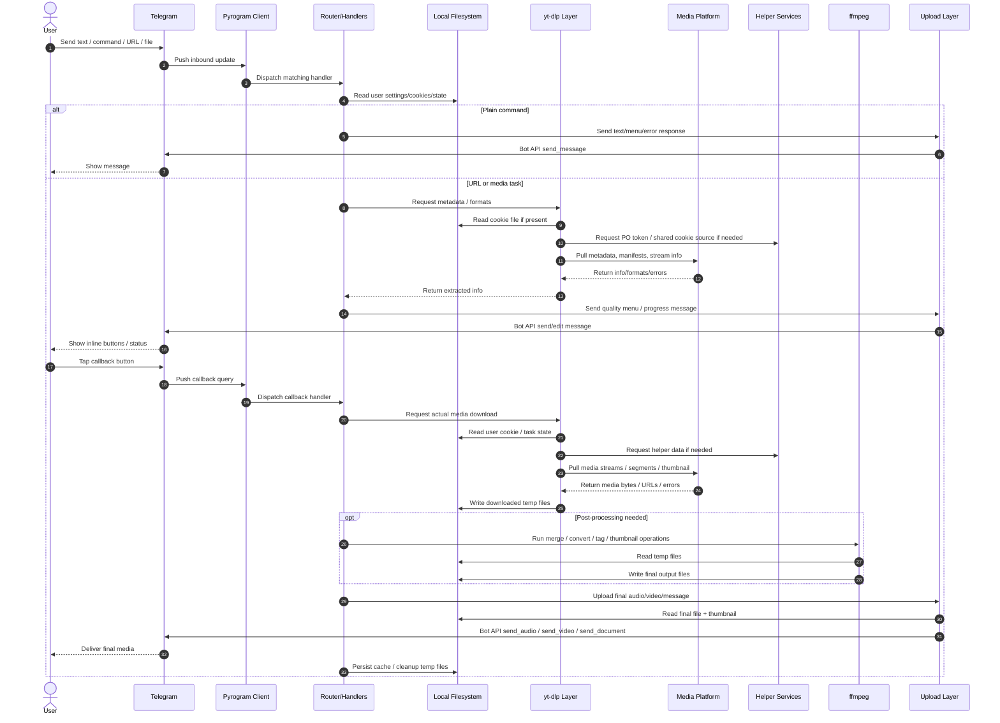
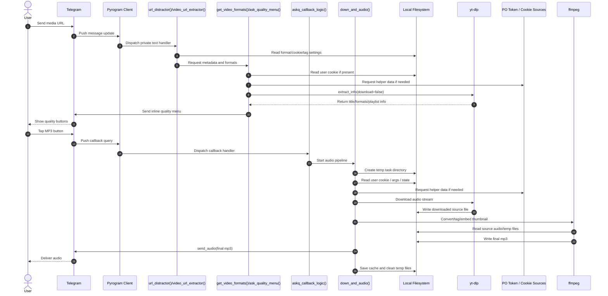
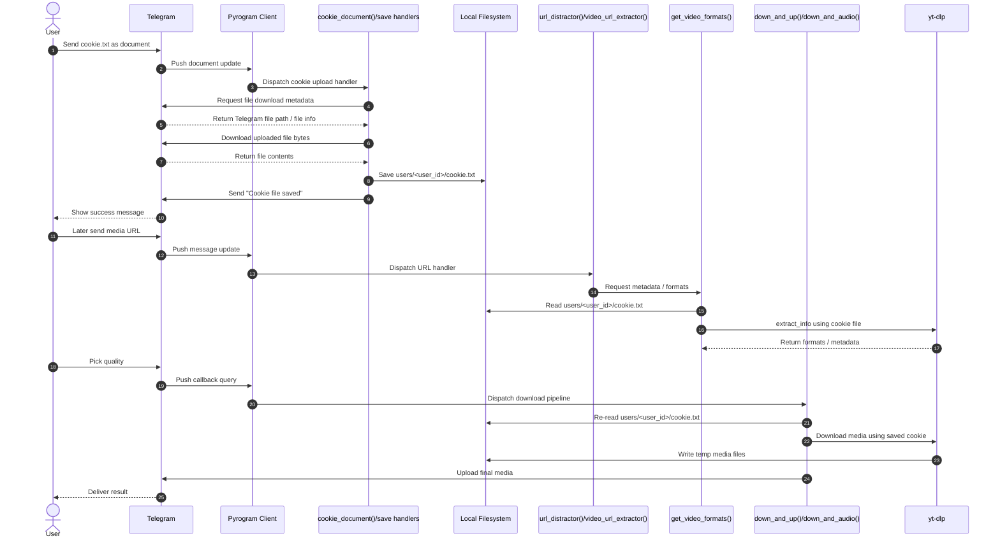

# Data Flow Sequence

## Overview

This document describes the runtime data flow of `tg-ytdlp-bot` from an inbound Telegram update to the final outbound Telegram media/message.

It focuses on mechanics:

- who the actors are
- who initiates each step
- what gets requested, written, or pushed
- where local state is read or persisted

## Main Actors

- **Telegram**: source of inbound updates and sink for outbound bot responses
- **Pyrogram Client**: live Telegram session created in `magic.py`
- **Router / Handlers**: command and URL dispatch, mainly `url_distractor()`
- **Format Extraction Layer**: metadata and format inspection via `yt-dlp`
- **Download Orchestrator**: video/audio pipelines in `down_and_up.py` and `down_and_audio.py`
- **Local Filesystem**: per-user settings, cookies, temp downloads, thumbnails, converted output
- **External Media Platforms**: YouTube, X/Twitter, TikTok, etc.
- **Helper Services**: PO token provider, internal cookie webserver, optional Firebase/cache
- **Telegram Upload Layer**: `safe_send_message()`, `send_videos()`, `app.send_audio()`

## Sequence Diagram

## Focused Example: URL to MP3

## Focused Example: Cookie Upload and Later Reuse

## Mechanics by Stage

### 1. Telegram to Router

- Telegram pushes an update to the bot session.
- The Pyrogram client receives it and calls the matching handler.
- For private text, the main entrypoint is `URL_PARSERS/url_extractor.py:url_distractor()`.

This stage is event-driven. The bot is passive until Telegram sends an update.

### 2. Router to Local State

- The router reads per-user files from `users/<user_id>/`.
- Typical reads:
  - `cookie.txt`
  - `format.txt`
  - `args.txt`
  - `tags.txt`
  - keyboard and language settings

At this point, the bot is pulling local state to decide what to do next.

### 3. Router to Extraction Layer

- If the message implies a media task, the router asks the extraction layer for metadata.
- This usually happens through `DOWN_AND_UP/yt_dlp_hook.py:get_video_formats()`.
- `yt-dlp` performs remote requests to the target platform.

This stage is a pull from the target website, not from Telegram.

### 4. Menu / Callback Round Trip

- After metadata is available, the bot pushes a message with inline buttons to Telegram.
- The user taps a quality or mode button.
- Telegram pushes a callback query back to the bot.
- The callback handler in `DOWN_AND_UP/always_ask_menu.py` converts that callback into a concrete download action.

This is a request-response loop with Telegram in the middle.

### 5. Download and Processing

- The orchestrator (`down_and_up()` or `down_and_audio()`) asks `yt-dlp` for the real media.
- `yt-dlp` reads cookies and options, calls helper services if needed, and pulls bytes from the remote platform.
- Downloaded artifacts are written to local task directories under `users/<user_id>/downloads/...`.
- If needed, `ffmpeg` is invoked to merge, convert, tag, split, or generate thumbnails.

This stage is mostly local orchestration around remote HTTP pulls and local file writes.

### 6. Final Upload

- The upload layer reads the final output file from disk.
- It then pushes the media back to Telegram using `send_video`, `send_audio`, or `send_document`.
- Telegram becomes the final sink and delivers the result to the user.

## Data Ownership

- **Telegram** owns inbound update objects and outbound delivered messages/media.
- **The bot process** owns routing decisions, retries, and orchestration.
- **The filesystem** owns persistent per-user state and temp artifacts.
- **yt-dlp / ffmpeg** own extraction and transformation work, but not final delivery.
- **External platforms** own the source metadata and media bytes.

## Forced Structure

These are structural facts of the current runtime model rather than optional policies.

- Inbound user interaction enters through Telegram updates received by the Pyrogram client.
- A private text URL must pass through the router layer before extraction or download begins.
- Format discovery must happen before an inline quality menu can be shown.
- A callback query must be received before a user-selected quality path can start.
- The bot must obtain media bytes from the source platform before it can deliver media to Telegram.
- In the current implementation, final Telegram media upload is performed from a locally materialized file, not from a direct source-to-Telegram stream.
- Post-processing steps such as conversion, merge, tagging, and thumbnail generation operate on local files.

## Contingent Policy

These are design choices in this codebase, not unavoidable properties of the problem class.

- Per-user state is stored under `users/<user_id>/...`.
- Cookie persistence uses `users/<user_id>/cookie.txt`.
- Saved user preferences such as format, args, tags, keyboard mode, and language are file-backed rather than stored in a database.
- Quality selection is exposed primarily through inline Telegram menus rather than pure text prompts.
- Helper services such as the PO token provider and internal cookie webserver are used to improve extractor reliability, but they are implementation choices.
- The bot uses local temp directories for task-scoped downloads, thumbnails, conversions, and cleanup.
- The current system prefers orchestration through Python + yt-dlp + ffmpeg rather than delegating final delivery to an external worker queue.

## Precedence Rules

These are the main operational precedence relations that determine continuation when multiple paths are available.

- Bot/outgoing messages are ignored by the main private text handler before normal user-text routing.
- Explicit command handling takes precedence over generic URL processing in the router.
- For “Always Ask” users, format discovery and callback selection take precedence over immediate direct download.
- A callback-selected quality takes precedence over a saved default format for that task.
- In the current download flow, a user-provided cookie is preferred over shared fallback cookie sources for actual downloads.
- Shared cookie sources are fallback mechanisms, not the primary user-state source.
- If extraction/download requires post-processing, ffmpeg output becomes the upload source; otherwise the directly downloaded artifact is the upload source.
- Final Telegram delivery uses the completed local artifact selected by the orchestrator, not the original remote stream URL.

## Important Distinction

The bot does not maintain a direct streaming pipe from a website into Telegram.

The usual pattern is:

1. receive Telegram update
2. request metadata from external platform
3. ask user for a choice
4. request media from external platform
5. write local files
6. upload the finished local file to Telegram

That local filesystem step is central to the runtime model.
