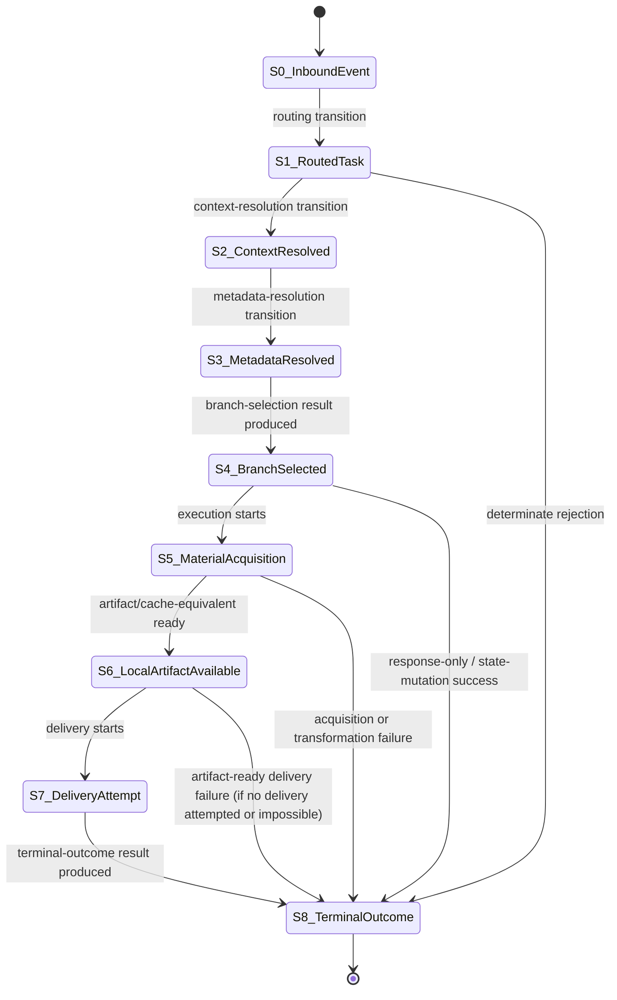

# Task State Machine Sketch

## Purpose

This document sketches a task-state machine for `tg-ytdlp-bot` using the explicit objects introduced in:

- [`09-branch-selection-result-model.md`](./09-branch-selection-result-model.md)
- [`10-terminal-outcome-result-model.md`](./10-terminal-outcome-result-model.md)

The goal is not to finalize implementation.
It is to provide a closed architectural skeleton showing:

- what the major states are
- what transition outputs should exist
- where authority changes
- where branch selection ends and execution begins
- where terminal outcome is assigned

This is the next natural PDA move because the main hidden objects are now explicit enough to connect.

## Governing Ambiguity

At this layer, the live ambiguity is no longer:

- what a task is
- what branch selection means
- what terminal outcome means

It is:

- what minimal state machine would let the current system be reasoned about as workflow software rather than as loosely coupled handlers

## Core Proposal

The task should be understood as evolving through a finite state machine whose key outputs are:

- a **branch-selection result**
- a **terminal-outcome result**

Everything else is either:

- input to transitions
- intermediate execution evidence
- or side effects produced after outcome meaning is assigned

## State Machine

## State Definitions

### S0. Inbound Event

The system has received a Telegram update.
No execution class has yet been assigned.

### S1. Routed Task

The update has been classified into an admissible task class or rejected.

### S2. Context-Resolved

The system has read enough user/task state to know what branches are potentially admissible.

### S3. Metadata-Resolved

The system has enough source-platform knowledge to know which concrete branches remain admissible.

### S4. Branch-Selected

A branch-selection result exists.
At this point:

- branch identity is explicit
- the selecting authority is explicit
- task scope is explicit enough for execution

### S5. Material Acquisition

The chosen branch is being executed:

- download
- direct response construction
- cache lookup/reuse
- or other admissible execution path

### S6. Local Artifact Available

A local deliverable or cache-equivalent result exists if the branch requires one.

### S7. Delivery Attempt

The system is attempting to satisfy user-facing delivery through Telegram.

### S8. Terminal Outcome

A terminal-outcome result exists.
At this point:

- task meaning is closed
- user-facing reporting class is known
- cache and cleanup policy can be driven by outcome rather than guessed

## Transition Outputs

The key transition outputs should be:

### `S3 -> S4`

Produces:

- `BranchSelectionResult`

### `S7 -> S8`

Produces:

- `TerminalOutcomeResult`

All other transitions may produce intermediate data, but these two are the main hidden architectural objects that need explicitness.

## Authority By State

### S0 -> S1

Primary authority:

- Telegram update type
- router logic

### S1 -> S2

Primary authority:

- persisted user state
- callback context
- task-local context

### S2 -> S3

Primary authority:

- source-platform feasibility
- extractor behavior
- access enablers

### S3 -> S4

Primary authority:

- explicit user choice if present
- saved user defaults otherwise
- cache policy where semantically valid
- inadmissibility pruning by source/access constraints

### S4 -> S7

Primary authority:

- execution feasibility under the selected branch
- local artifact creation/reuse
- Telegram delivery acceptance

### S7 -> S8

Primary authority:

- delivered-vs-requested scope
- existence of valid artifacts
- Telegram delivery status
- branch family and task class

## Invariants Of The Machine

If this sketch is accepted, the following invariants should hold.

- No media-delivery task reaches terminal success without either valid delivery or semantically valid cache reuse.
- Branch identity should not need to be reconstructed after `S4`.
- Terminal meaning should not need to be reconstructed after `S8`.
- Cleanup and cache writes are not state-machine states; they are side effects driven by `S8`.
- Response-only and state-mutation tasks may bypass artifact-oriented states.

## Legitimate Short-Circuits

Not every task must traverse every state.

Legitimate short-circuits include:

- `S1 -> S8`
  determinate rejection
- `S4 -> S8`
  response-only success or state-mutation success
- `S5 -> S8`
  acquisition/transformation failure before valid deliverable exists

These are not violations.
They are admissible machine paths for different task classes.

## Illegitimate Collapses

The following collapses should be resisted because they reintroduce concealed arbitrariness.

- collapsing branch selection into raw format strings
- collapsing terminal outcome into success counters plus side effects
- collapsing local artifact success into final task success
- collapsing cache reuse into ordinary success without preserving branch provenance
- collapsing callback continuation into generic message handling without preserving task linkage

## Current Code Approximation

The current code approximates this machine, but implicitly.

Roughly:

- `url_distractor()` and registered handlers cover `S0 -> S1`
- `video_url_extractor()` and user-state helpers cover `S1 -> S2`
- `get_video_formats()` and `ask_quality_menu()` cover `S2 -> S3`
- `askq_callback_logic()` and direct-download decision points approximate `S3 -> S4`
- `down_and_up()` / `down_and_audio()` cover much of `S4 -> S7`
- terminal meaning is distributed across orchestrators, sender, logger, and cleanup logic instead of one explicit `S7 -> S8` result

## What This Makes Visible

The main architectural issue is now clearer:

- the system already behaves like a task-state machine
- but it does not yet expose its state machine explicitly

That is why many bugs feel like local handler problems while actually being transition-boundary problems.

## What This Suggests Next

The next natural move after this sketch is likely one of:

- define an explicit `Task` object carrying current state plus branch/terminal results
- define transition contracts for `S3 -> S4` and `S7 -> S8`
- choose one transition boundary to centralize first in code, most likely branch selection or terminalization

## Recomposition

Recomposed at this layer:

`tg-ytdlp-bot` can now be described as an implicit task-state machine with explicit conceptual outputs but not yet explicit implementation objects.

That is a much tighter formulation than "a bot with handlers."

## Related Documents

- [`Task Object Model`](./12-task-object-model.md): explicit primary runtime object implied by the state machine
